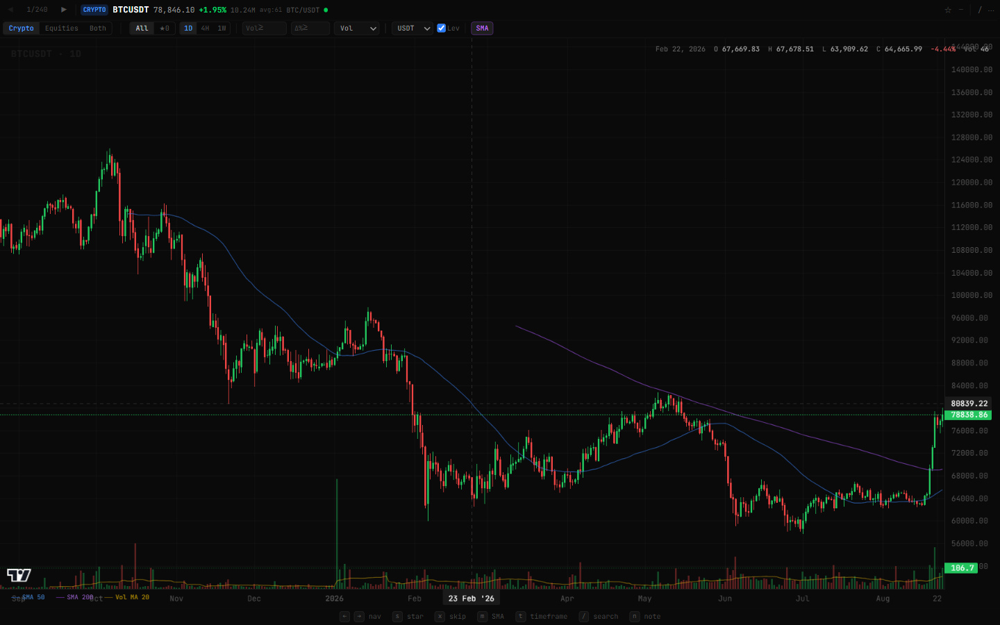
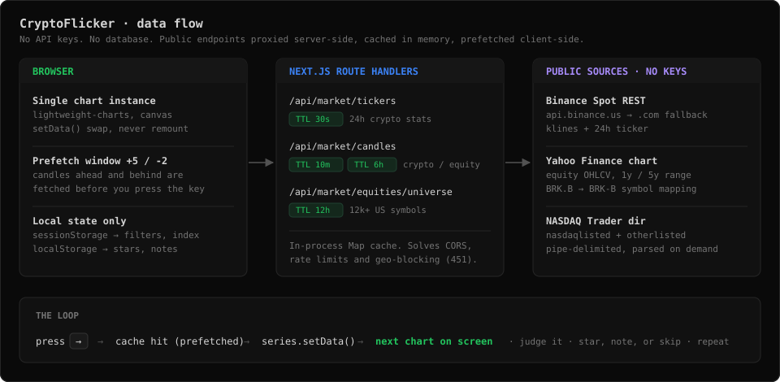
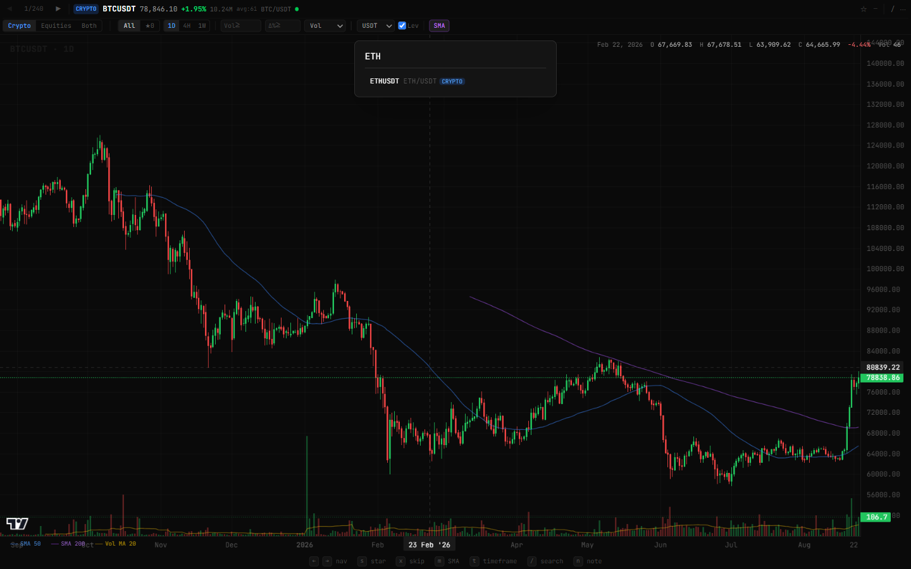
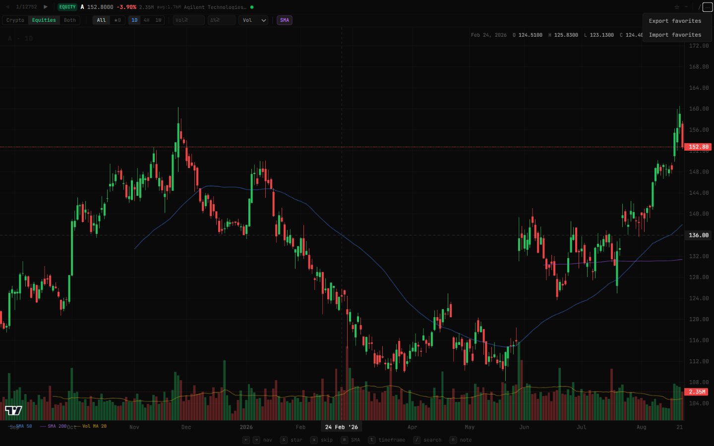

<h1 align="center">CryptoFlicker</h1>

<p align="center">
  <strong>A chart screener you drive like a card deck.</strong><br>
  Hold the arrow key and flip through thousands of candlestick charts — one per keystroke, no page loads, no spinners.
</p>

<p align="center">
  
  
  
  
  
</p>



---

## Why this exists

Scanning charts on a normal platform means click symbol → wait → squint → go back → click the next one. Three seconds of friction per chart, and pattern recognition dies somewhere in there.

CryptoFlicker removes the friction. One persistent chart canvas, keyboard navigation, and a prefetch window that loads the symbols ahead of you before you ask for them. Charts arrive as fast as you can press `→`, so your eye stays in the loop instead of the network.

Roughly 240 Binance spot pairs and 12,000+ US-listed equities, in one deck.

## How it works



Three ideas carry the whole app:

1. **One chart, forever.** The `lightweight-charts` instance is created once and fed new data with `setData()`. No remount, no re-init, no layout thrash between symbols.
2. **Prefetch the neighbours.** Landing on a symbol also pulls the next five and the previous two in the background, so the common case is a cache hit and a repaint.
3. **Proxy and cache on the server.** Route handlers sit in front of every upstream API — that solves CORS, absorbs rate limits, survives Binance's regional `451`s, and keeps the client free of keys.

## What it looks like

<table>
<tr>
<td width="50%">
<br>
<strong>Quick jump</strong> — press <code>/</code>, type a few letters, hit Enter. Searches the whole active universe by symbol or company name.
</td>
<td width="50%">
<br>
<strong>Two asset classes</strong> — crypto, US equities, or both interleaved in a single deck of 12k+ instruments.
</td>
</tr>
</table>

## Quick start

**Requirements:** Node.js 20.9 or newer, and npm. Nothing else — no API key, no account, no database.

```bash
git clone https://github.com/chrisconnelly3/cryptoflicker.git
```

```bash
cd cryptoflicker && npm install
```

```bash
npm run dev
```

Then open **<http://localhost:3000/screener>** and hold the right arrow key.

To run a production build instead:

```bash
npm run build && npm start
```

### Deploying

It is a stock Next.js app with no persistence layer, so any Node host works. On Vercel, import the repo and accept the defaults — no environment variables are required.

## Keyboard map

| Key | Action |
|-----|--------|
| `→` / `l` | Next symbol |
| `←` / `h` | Previous symbol |
| `s` | Star / unstar the current symbol |
| `x` | Skip / unskip (greys it out for this session) |
| `m` | Toggle SMA overlays (50 / 200 SMA + 20-period volume MA) |
| `t` | Cycle timeframe (1D → 4H → 1W) |
| `/` | Quick-jump search |
| `n` | Add or edit a note on the current symbol |
| `Esc` | Close search / cancel the note |

## Features

**Charting**
- Candlesticks plus a volume histogram, rendered to canvas by TradingView's [Lightweight Charts](https://github.com/tradingview/lightweight-charts)
- Crosshair readout: date, O/H/L/C, % change and volume for whatever candle you hover
- 50 and 200 period SMAs, plus a 20-period volume moving average
- Timeframes: 1D, 4H, 1W (equities fall back to daily bars, where the upstream range does not offer 4H)

**Screening**
- Filter by minimum average volume and minimum % change — positive for gainers, negative for losers
- Sort by volume, % change, price, or trade count
- Crypto only: pick the quote asset (USDT, BTC, ETH, BNB, FDUSD) and exclude leveraged tokens (UP/DOWN/BULL/BEAR)
- Star symbols with `s` and flip the deck to favourites-only

**Session and notes**
- Notes and stars persist in `localStorage`; export and import them as JSON from the `⋯` menu
- Filters, timeframe and your position in the deck persist in `sessionStorage`, so reopening the tab drops you back where you were
- Filters are mirrored into the URL, so a screening setup is a shareable link
- Skips are deliberately session-scoped — they clear when the tab closes

**Interface**
- Dark, dense, monospaced (JetBrains Mono), built to be read at a glance
- A cache dot next to the symbol shows green when the chart came from cache and amber while fetching

## Project structure

```
src/
├─ app/
│  ├─ api/market/
│  │  ├─ tickers/route.ts            # Binance 24h stats      (30s cache)
│  │  ├─ candles/route.ts            # OHLCV, both classes    (10m crypto / 6h equity)
│  │  └─ equities/universe/route.ts  # US symbol directory    (12h cache)
│  └─ screener/page.tsx              # the screener itself
├─ components/CandleChart.tsx        # chart lifecycle + overlays
├─ hooks/useFavorites.ts             # stars and notes
└─ lib/
   ├─ binance.ts                     # endpoint fallback (.us → .com)
   ├─ yahoo.ts                       # equity OHLCV + symbol mapping
   ├─ indicators.ts                  # SMA maths
   └─ cache.ts                       # in-memory TTL cache
```

## Configuration

Everything works out of the box. One optional override exists:

| Variable | Default | Description |
|----------|---------|-------------|
| `BINANCE_BASE_URL` | auto | Force a Binance base URL. By default the app tries `api.binance.us`, then `api.binance.com`, and remembers whichever answered. |

## Good to know

- **Data sources** are public, keyless endpoints: Binance Spot REST, the Yahoo Finance chart API, and the NASDAQ Trader symbol directory. Treat them as best-effort — they are rate limited, unversioned, and can change without notice.
- **Regional blocking**: if both Binance hosts return `451` where you are, crypto mode will come up empty. Equities mode is unaffected.
- **The cache is per process** and in memory, which is the right size for a single-user tool and the wrong size for a fleet of serverless instances. Swap in Redis if you deploy this for real traffic.
- **Not financial advice.** This is a chart viewer. It has no opinion about what you should buy.

## Credits

Charts by [Lightweight Charts](https://github.com/tradingview/lightweight-charts) (Apache-2.0). Built with Next.js, React, TypeScript and Tailwind CSS.
